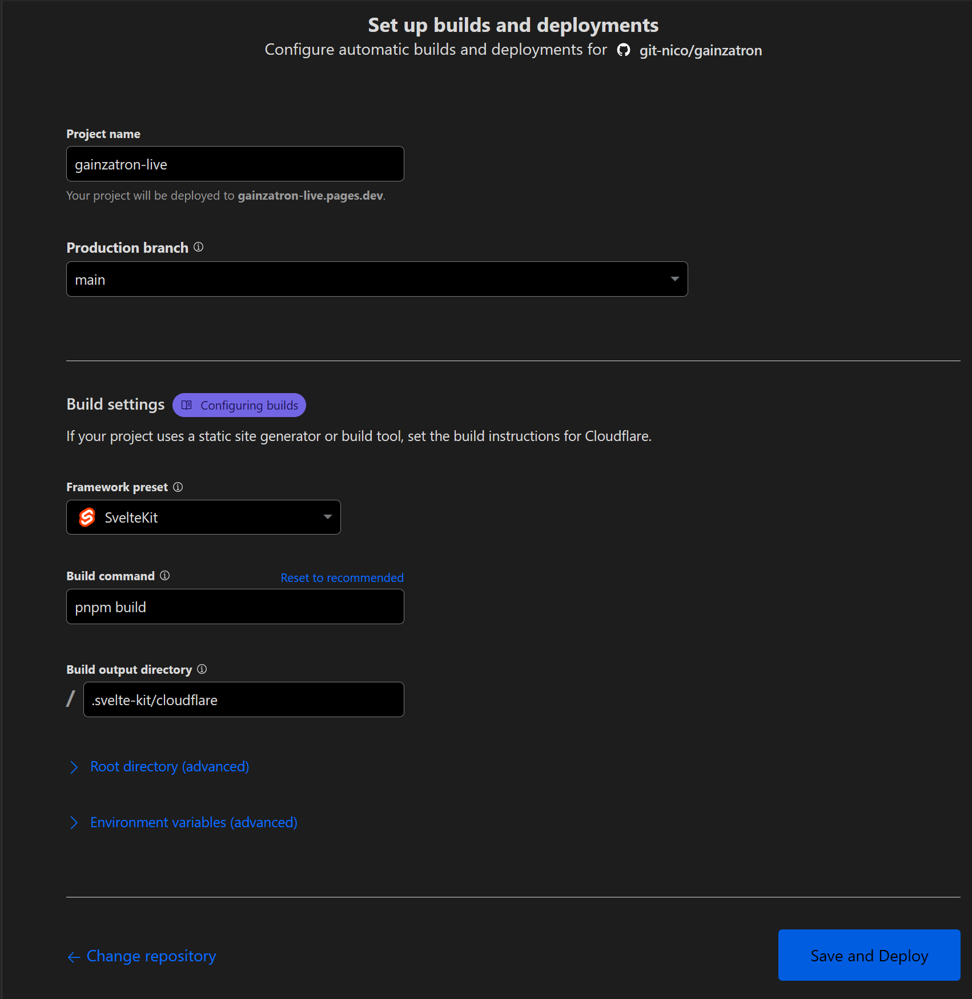
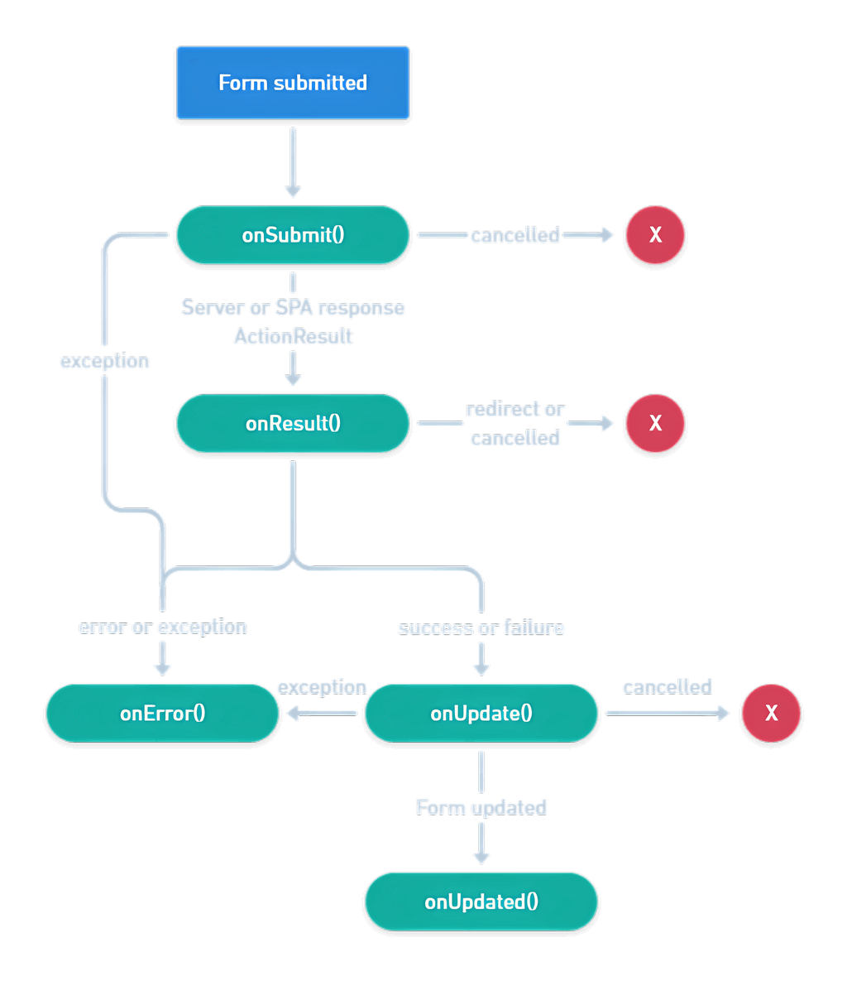
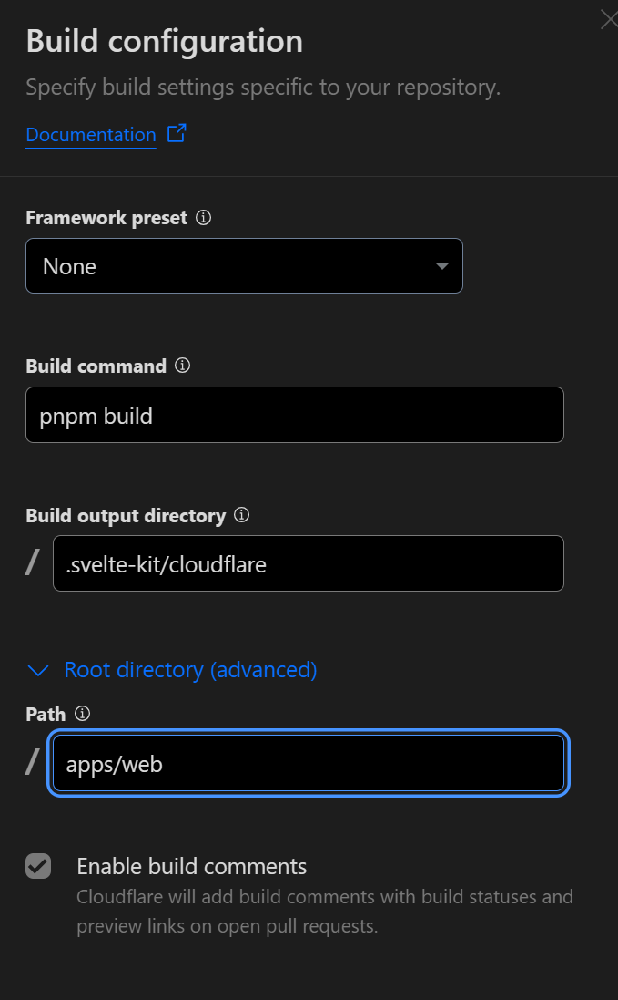

# Steerlist


[steerlist-live.pages.dev](https://steerlist-live.pages.dev/)

## Git Setup

After installing **git**, you’ll want to do a few things to customize your Git environment.  
Git comes with a tool called **git config** that lets you get and set configuration variables that control all aspects of how Git looks and operates. These variables can be stored in three different places:

> | scope  | Location                         | filename   |
> | ------ | -------------------------------- | ---------- |
> | system | &lt;installation folder&gt;\\etc | gitconfig  |
> | global | C:\\Users\\&lt;username&gt;      | .gitconfig |
> | local  | git repo's .git folder           | .gitconfig |

You can view all of your settings and where they are coming from using:

```sh
git config --list --show-origin --show-scope
```

### Your Identity

The first thing you should do when you install Git is to set your user name and email address. This is important because every Git commit uses this information, and it’s immutably baked into the commits you start creating:

```sh
git config --global user.name "John Doe"
git config --global user.email johndoe@example.com
```

### Default branch name

By default Git will create a branch called master when you create a new repository with git init. From Git version 2.28 onwards, you can set a different name for the initial branch.

```sh
git config --global init.defaultBranch main
```

### CRLF of LF

If you’re programming on Windows and working with people who are not (or vice-versa), you’ll probably run into line-ending issues at some point. This is because Windows uses both a carriage-return character and a linefeed character for newlines in its files, whereas Mac and Linux systems use only the linefeed character. This is a subtle but incredibly annoying fact of cross-platform work; many editors on Windows silently replace existing LF-style line endings with CRLF, or insert both line-ending characters when the user hits the enter key.

Git can handle this by auto-converting CRLF line endings into LF when you add a file to the index, and vice versa when it checks out code onto your filesystem. You can turn on this functionality with the core.autocrlf setting. If you’re on a Windows machine, set it to true – this converts LF endings into CRLF when you check out code

> | autocrlf | file to commit | repository | checked out file |
> | -------- | -------------- | ---------- | ---------------- |
> | true     | x (crlf or lf) | lf         | crlf             |
> | input    | x (crlf or lf) | lf         | lf               |
> | false    | x (crlf or lf) | x          | x                |

Since all modern editors can deal with both line endings and since most npm packages have LF as eol, it seems that nowadays we can ser the **autocrl** to **input** This in combination with vscode and prettier saving the files with LF as the eol too.

```sh
git config --global core.autocrlf input
```

### Set the default coniguration editor

The default configuratiom editor is set to **vim**  
You can change this to a different editor, like for example vscode

```sh
got config --global core.editor "code --wait"
```

### Set the default diff tool

The **\*`git diff`** command shows the diferences in the terminal (using vimdiff)  
If you want these differences shown in vscode add the following configuration

```sh
# specify vscode as a diff tool
git config --global diff.tool vscode
#specify the commad to use
git config --global difftool.vscode.cmd 'code --wait --diff $LOCAL $REMOTE'
```

### Set the default merge tool

There is no default merge too but if you want vscode to be the merge tool add the following configuration

```sh
# specify vscode as a merge tool
git config --global merge.tool vscode
#specify the commad to use
git config --global mergetool.vscode.cmd 'code --wait $MERGED'
```

_the wait flag tells the terminal to wait until the vscode instanstance is closed_

### Checking Your Settings

Use this If you want to check your configuration settings

```sh
git config --list
```

### Remove or Edit a Configuration setting

To edit a configureation use: _git config --&lt;scope&gt; --edit_

```sh
git config --global --edit
```

To remove a flag from a setting use: _git config --&lt;scope&gt; --unset flag_

```sh
git config --global --unset user.name
```

### Github Authentication

Once you have created a repository in Github and yu vave linked your local repository to it with  
**`git remote add origin https://github.com/git-nico/steerlist.git`**  
You need to have been authenticated in order to push your code to Github.

Authentication with plain username and password is no longer allowed in Github. In stead **use username / Access Token** or OAuth

#### Personal access token

- goto Github
- goto account settings
- click developer settings
- click Personal access tokens
- choose Tokens (classic)
- click generate token
    - set expiration
    - select everything

#### Credential helpers

Depending on the platform, git comes with several helpers to avoid having to input the same credentials over and over.

- **git-credential-store**: saves credentials in plaintext.
- **git-credential-cache**: holds credentials temporarily in process memory
- **git-credential-osxkeychain**: stores in macOS keychain
- **git-credential-libsecret**: stores in Linux secret service
- **git-credential-wincred**: stores in Windows Credential Manager
- **git-credential-manager**: OAuth (included with git for windows)
- **git-credential-oauth**: OAuth (included in linux distributions)

```sh
# example
git config credential.helper store
```

**In the latest version, when you install `git for windows`, the default credential helper is set to "manager" (git-credential-manager)**

**When you use the latest portable version, the default credential helper is set to "helper-selector".** The first time, credentials are needed, a popup will appear where you can choose between "git-credential-wincred" and "git-credential-manager"

### Git Commands

> | command                             | Description                                                            |
> | ----------------------------------- | ---------------------------------------------------------------------- |
> | _git init_                          | create an empty git repository                                         |
> | _git add file1 file2_               | add file(s) to the staging area                                        |
> | _git commit -m "message"_           | commit the staged snapshot                                             |
> | _git commit -am "message" file1_    | add and commit file1                                                   |
> | _git status_                        | List which files are staged, unstaged, and untracked.                  |
> | _git status_-s                      | Short status                                                           |
> | _git mv file1 file2_                | will move / rename file1 into file3 in working **and** staging area    |
> | _git rm file1_                      | will remove file1 from working directory **and** staging area          |
> | _git diff_                          | show differences beteween working directory with staged area           |
> | _git diff --staged_                 | view the changes you staged for the next commit                        |
> | _git log_                           | Display the entire commit history                                      |
> | _git log --oneline_--reverse        | Display the entire commit history in short form, from first to last    |
> | _git resore --staged file1_         | restore file1 in working directory, staging area now has last snapshot |
> | _git resore --staged ._             | restore everything in the staging area                                 |
> | _git clean -fd_                     | remove untracked files and directory                                   |
> | _git restore file1_                 | resore file1 form staging or else from latest snapshot                 |
> | _git restore --source=HEAD~1 file1_ | restore file1 from the commit before the last one                      |
> | _git push_                          | update remote repository                                               |
> | _git pull_                          | Fetch from and integrate with local branch                             |

## Bits UI

[bits-ui.next](https://next.bits-ui.com/docs/introduction)

- Bits is a Headless UI Component library
- Shadcn-svelte, on the other hand, is a self-owned styled UI Component library - It ships a design system and opinionated styles on top of the Headless components but in a way that you own them (So it's pretty easy to change the components if you need it).

```sh
# at the moment install next version for Svelte 5 runes version
pnpm add -D bits-ui@next
```

## Shadcn-Svelte

[next.shadcn-svelte](https://next.shadcn-svelte.com/docs/installation/sveltekit)

> <span style="color:tomato">Initializing Shadcn Svelte will overwrite **/src/app.css**</span>

```sh
# at the moment install next version for Svelte 5 runes version
pnpm dlx shadcn-svelte@next init
```

> Which style would you like to use?  
> │ New York  
> │  
> ◇ Which base color would you like to use?  
> │ Stone  
> │  
> ◇ Where is your global CSS file? (this file will be overwritten)  
> │ src\app.css  
> │  
> ◇ Where is your Tailwind config located? (this file will be overwritten)  
> │ tailwind.config.ts  
> │  
> ◇ Configure the import alias for components:  
> │ $lib/components  
> │  
> ◇ Configure the import alias for utils:  
> │ $lib/utils  
> │  
> ◇ Configure the import alias for hooks:  
> │ $lib/hooks  
> │  
> ◇ Configure the import alias for ui:  
> │ $lib/components/ui  
> │  
> ◇ Config file components.json created  
> │  
> ◇ Project initialized  
> │  
> ◇ Dependencies installed with pnpm  
> │  
> └ Success! Project initialization completed.

## Add components

```sh
pnpm dlx shadcn-svelte@next add button
```

```html
<script lang="ts">
	import { Button } from '$lib/components/ui/button/index.js';
</script>

<button>Click me</button>
```

## Playwright

> <span style="color:tomato">Running the install script will overwrite **/playwright.config.ts**</span>

```sh
pnpm create playwright
```

- Choose between TypeScript or JavaScript (default is TypeScript)
- Name of your Tests folder (default is tests or e2e if you already have a tests folder in your project)
- Add a GitHub Actions workflow to easily run tests on CI
- Install Playwright browsers (default is true)

### Playwright in combination with MSW

When you are not using the Mock Service Worker in combination with Playwright, make sure the **`playwright.config.ts`** is in line with the invironment settings. If you want to run the Playwright tests via a Github action, you can use a **`.env.test`** that you copy to **`.env`** in the action.

> **_.env.test_**
>
> ```sh
> MSW_ENABLED=true
> RESEND_API_KEY='RESEND_API_KEY'
> RESEND_AUDIENCE_ID='RESEND_AUDIENCE_ID'
> ```

> **_playwright.yml_**
>
> ```yaml
> name: Playwright Tests
> on:
>   push:
>     branches: [main, master]
>   pull_request:
>     branches: [main, master]
> jobs:
>   test:
>     timeout-minutes: 60
>     runs-on: ubuntu-latest
>     steps:
>       - uses: actions/checkout@v4
>       - uses: actions/setup-node@v4
>         with:
>           node-version: lts/*
>       - name: Install dependencies
>         run: npm install -g pnpm && pnpm install
>       - name: Install Playwright Browsers
>         run: pnpm exec playwright install --with-deps
>       # playwright needs the environment variables
>       # copy them from .env.timeout-minutes
>       - name: Copy environment variables
>         run: cp .env.test .env
>       - name: Run Playwright tests
>         # run: pnpm exec playwright test
>         run: pnpm test:e2e
>       - uses: actions/upload-artifact@v4
>         if: ${{ !cancelled() }}
>         with:
>           name: playwright-report
>           path: playwright-report/
>           retention-days: 30
> ```

## Fonts

```sh
pnpm add -D @fontsource/cherry-swash
```

+layout.svelte

```html
<script lang="ts">
	import '@fontsource/cherry-swash';
</script>
```

app.css

```css
:root {
	--font-family-heading: 'Cherry Swash', system-ui;
}
```

## Images

- [unDraw](https://undraw.co/)
- [Unsplash](https://unsplash.com/)

## Playwright Github Workflow

When the Playwright workflow fails with the error:  
<span style="color: tomato">ERR_PNPM_OUTDATED_LOCKFILE  Cannot install with "frozen-lockfile" because pnpm-lock.yaml is not up to date with <ROOT>/package.json</span>

do the following

- remove **pnpm-lock.yaml**
- push the change to github

## Cloudflare Pages

[Cloudflare Pages](https://pages.cloudflare.com/)

[Build and deploy](https://svelte.dev/docs/kit/adapter-cloudflare)

install the Cloudflare adapter

```sh
pnpm i -D @sveltejs/adapter-cloudflare
```

add the adapter to your **svelte.config.js**:

```javascript
import adapter from '@sveltejs/adapter-cloudflare';

export default {
	kit: {
		adapter: adapter({
			// See below for an explanation of these options
			routes: {
				include: ['/*'],
				exclude: ['<all>'],
			},
			platformProxy: {
				configPath: 'wrangler.toml',
				environment: undefined,
				experimentalJsonConfig: false,
				persist: false,
			},
		}),
	},
};
```

### Create .node-version

you can specify the node version Cloudflare should use by creating the file **.node-version**  
The content should be just the version number

```text
23.1.0
```

#### Create an application in Cloudflare Pages

- Goto **Workers & Pages**
- Click **Create**
- Click **Pages**
- Connect to Git



### Add environment variables

- Goto **Workers & Pages**
- Click **steerlist-live**
- Select the **settings** tab
- Click / Goto **Variables and Secrets**

https://steerlist-live.pages.dev/

[See Paert 2](#cloudflare-2)

## The Essential Meta Tags for Social Media

[CSS Tricks](https://css-tricks.com/essential-meta-tags-social-media/)

[Favicon generator](https://realfavicongenerator.net/)

[Preview and Generate Open Graph Meta Tags](https://www.opengraph.xyz/)

[SVG to PNG](https://svgtopng.com/)

```html
<!--  Essential META Tags -->
<meta property="og:title" content="European Travel Destinations" />
<meta property="og:type" content="article" />
<meta property="og:image" content="http://euro-travel-example.com/thumbnail.jpg" />
<meta property="og:url" content="http://euro-travel-example.com/index.htm" />
<meta name="twitter:card" content="summary_large_image" />

<!--  Non-Essential, But Recommended -->
<meta property="og:description" content="Offering tour packages for individuals or groups." />
<meta property="og:site_name" content="European Travel, Inc." />
<meta name="twitter:image:alt" content="Alt text for image" />

<!--  Non-Essential, But Required for Analytics -->
<meta property="fb:app_id" content="your_app_id" />
<meta name="twitter:site" content="@website-username" />
```

## Install Lucide Svelte

```sh
pnpm add -D lucide-svelte
```

## Superforms

installation

```sh
pnpm i -D sveltekit-superforms zod
```

### Steps to create a Superform

1.  **Create a validation schema**

    - should be defined outside the load function (to make caching work).

    > **_schema.ts_**
    >
    > ```typescript
    > import { z } from 'zod';
    >
    > export const newsletterSchema = z.object({
    > 	email: z.string().email(),
    > });
    >
    > export type NewsletterSchema = typeof newsletterSchema;
    > ```

2.  **Initialize the form in the load funtion**

    - import an adapter corresponding to your library of choice, together with the schema, and pass it in a load function to the superValidate function (also called server API)
    - Empty form: **_const form = await superValidate(zod(schema));_**
    - Populated form: **_const form = await superValidate(user, zod(schema));_**
    - Unless you call the SvelteKit redirect or error functions, you should always return the form object to the client, either directly or through a helper function. The name of the variable doesn’t matter; you can call it { loginForm } or anything else

    > **_+page.server.ts_**
    >
    > ```typescript
    > export const load = async () => {
    > 	const form = await superValidate(zod(schema));
    >
    > 	// Always return { form } in load functions
    > 	return { form };
    > };
    > ```

3.  **Display the form**

    - the server API returns the data to the client where it can be used to initiate the form
    - const { form } = superForm(data.form); (Client API)
    - bind:value is used for 3-way binding between form data and input fields

    > **_+page.svelte_**
    >
    > ```html
    > <script lang="ts">
    > 	import { superForm } from 'sveltekit-superforms';
    > 	let { form }: { form: ActionData } = $props();
    > </script>
    >
    > <form method="POST">
    > 	<input type="text" name="name" bind:value="{form.name}" />
    > </form>
    > ```

4.  **Post the data**

    - In the form actions, defined in +page.server.ts, we’ll use the superValidate function again, but now it should handle **`FormData`**. This can be done in several ways:
        - Use the **`request`** parameter (which contains FormData)
        - Use the **`event`** object (which contains the request)
        - Use **`FormData`** directly, if you need to access it before calling superValidate.

    > **_+page.server.ts_**
    >
    > ```typescript
    > export const actions = {
    > 	default: async ({ request }) => {
    > 		const form = await superValidate(request, your_adapter(schema));
    >
    > 		if (!form.valid) {
    > 			return fail(400, { form });
    > 		}
    >
    > 		// TODO: Do something with the validated form.data
    >
    > 		return message(form, 'Form posted successfully!');
    > 	},
    > };
    > ```

5.  **Display errors**

    - If the validation has failed, we need to diplay the errors by adding properties to the destructuring assignment of superForm:

    > **_+page.svelte_**
    >
    > ```html
    > <script lang="ts">
    > 	let { data }: { data: PageData } = $props();
    > 	const { form, errors, constraints, message, delayed } = superForm(data.form);
    > </script>
    >
    > {#if $message}
    > <h3>{$message}</h3>
    > {/if}
    >
    > <form method="POST">
    > 	<input type="text" name="name" bind:value="{form.name}" {...$constraints.name} />
    > 	{#if $errors.name}<span class="invalid">{$errors.name}</span>{/if}
    > </form>
    > ```

6.  **Using Toast Messages**

    - Events during the `submit` process can be the starting point for showing toast messages.These events are available when `javascript` is enabled and when Superforms's custom **`use:enhance`** is added to the form.
    - The return of a valid form as well as a fail of a form will trigger the **`onUpdated`** event. The **`onError`** event is triggered when an error is thrown.

    

    - To differentiate between a `fail` and a `success` toast message, it is recommended to use the Superforms's **`message`** helper function. You can return any type with the message, like an object, if you want to send more information than a string. - To simplify this even further, if you have the same type for all status messages across the project, you can add a Message type to the App.Superforms namespace in src/app.d.ts, and it will be automatically set, no need for generic type parameters:

        > **_src/app.d.ts_**
        >
        > ```typescript
        > declare global {
        > 	namespace App {
        > 		// interface Error {}
        > 		// interface Locals {}
        > 		// interface PageData {}
        > 		// interface PageState {}
        > 		// interface Platform {}
        > 		namespace Superforms {
        > 			type Message = {
        > 				type: 'error' | 'success';
        > 				text: string;
        > 			};
        > 		}
        > 	}
        > }
        > ```

    - On the server side you can now use the **`message`** helper as follows:

    > **_+page.server.ts_**
    >
    > ```typescript
    > import { error, fail } from '@sveltejs/kit';
    > import { message, superValidate } from 'sveltekit-superforms';
    >
    > export const actions: Actions = {
    > 	default: async ({ request }) => {
    > 		// Standard Superforms validation code here
    > 		// ...
    >
    > 		if (email.includes('spam')) {
    > 			// will trigger onUpdated event
    > 			return message(form, { type: 'error', text: 'Invalid email' });
    > 		}
    >
    > 		if (email.includes('error')) {
    > 			// throw error, will trigger onError event
    > 			error(500, 'Something went wrong!');
    > 		}
    >
    > 		// will trigger onUpdated event
    > 		return message(form, { type: 'success', text: "You're signed up" });
    > 	},
    > };
    > ```

    - in the **`form`** you can now extend the **`use:enhanced`** to trigger the toast messages

    > ```html
    > <script lang="ts">
    > 	const form = superForm(data, {
    > 		validators: zodClient(newsletterSchema),
    > 		delayMs: 300,
    > 		timeoutMs: 8000,
    > 		resetForm: false,
    > 		onSubmit: () => {
    > 			toast.success('Submitting the form...');
    > 		},
    > 		taintedMessage: null,
    > 		onUpdated: ({ form, result }) => {
    > 			if (form.message) {
    > 				if (form.message.type === 'success') {
    > 					toast.success(form.message.text);
    > 					reset();
    > 				} else {
    > 					toast.error(form.message.text);
    > 				}
    > 			}
    > 		},
    > 		onError: ({ result }) => {
    > 			toast.error(result.error.message);
    > 		},
    > 	});
    >
    > 	const { form: formData, enhance, constraints, reset, delayed } = form;
    > </script>
    >
    > <form method="POST" {id} class="flex flex-col gap-4" use:enhance>
    > 	<!-- form content here -->
    > </form>
    > ```

### Using a Spinner in a parent component

When the form and the submit are in the same component, a Spinner is relative easy to implement

```html
<script lang="ts">
	const { form, errors, enhance, delayed } = superForm(data.form);
	import spinner from '$lib/assets/spinner.svg';
</script>

<form method="POST" use:enhance>
	<button>Submit</button>
	{#if $delayed}
	
	{/if}
</form>
```

But when the submit is in the parent, you need to use a **`callback`** function to gat the information to the parent.

> **_parent_**
>
> ```html
> <script lang="ts">
> 	import Form from './Form.svelte';
> 	import Spinner from './$lib/Spinner.svelte';
>
> 	let delayed = $state(false);
>
> 	const isDelayedCallback = (isDelayed: boolean) => {
> 		delayed = isDelayed;
> 	};
> </script>
>
> <form method="POST" use:enhance>
> 	<form id="formId" data="{myFormData}" {isDelayedCallback} />
>
> 	<button form="formId">
> 		Submit {#if delayed}
> 		<Spinner />
> 		{/if}
> 	</button>
> </form>
> ```

**_child_**

```html
<script lang="ts">
	type Props = {
		id: string;
		data: SuperValidated<Infer<MySchema>>;
		isDelayedCallback?: (isDelayed: boolean) => void;
	};

	let { id, data, isDelayedCallback }: Props = $props();

	const { form, errors, enhance, delayed } = superForm(data.form);

	$effect(() => {
		isDelayedCallback && isDelayedCallback($delayed);
	});
</script>

<form method="POST" {id} use:enhance>
	<form id="formId" data="{myFormData}" {isDelayedCallback}>
		<!-- Form fields here -->
	</form>
</form>
```

### Debug Superforms

```html
<script lang="ts">
	import SuperDebug from 'sveltekit-superforms';
</script>

<SuperDebug data="{$form}" />
```

## Install Resend

[website](https://resend.com/)

[Resend](https://resend.com/) is a tool that lets you send emails from your own domain with ease and reliability. It offers a simple interface, SDKs, webhooks, React templates, and multi-region support.

```bash
pnpm add -D resend
```

Add the **API key** and **Audience ID** to **.env.local**

- run **_pnpm build_** to generate the variables in **./svelte-kit/ambient.d.ts**

## Mock Service Worker (MSW)

[Mock Service Worker](https://mswjs.io/) is an API mocking library that allows you to write client-agnostic mocks and reuse them across any frameworks, tools, and environments.

```bash
pnpm add -D msw
```

The Mock Server needs to run, so it can intercept the http calls. The best place for this is in the **hooks.server.ts**. this file is only read once at the very first request to the server.<br> Needless to say, it should not run in production.<br> By adding a check for an environment variable content, we can achieve this.

[Get Started Guide](https://mswjs.io/docs/getting-started)

## Using Markdown

[marked](https://marked.js.org/)

Marked is:

1. built for speed.
2. a low-level markdown compiler for parsing markdown without caching or blocking for long periods of time.
3. light-weight while implementing all markdown features from the supported flavors & specifications.
4. available as a command line interface (CLI) and running in client- or server-side JavaScript projects.

```sh
pnpm add -D marked
```

It is now possible to parse all the descriptions (they contain markdown) in a programme.

- the pogramme lead / description
- the workout day description

> **_$lib/repos/programme/HardcodedProgramRepo.ts_**
>
> ```typescript
> export class HardcodedProgramRepo implements ProgrammeRepoInterface {
> 	async getCurrent(): Promise<WorkoutWeek> {
> 		return {
> 			...programme,
> 			description: await marked.parseInline(programme.description),
> 			days: await Promise.all(
> 				programme.days.map(async (day) => ({
> 					...day,
> 					description: await marked.parseInline(day.description),
> 				}))
> 			),
> 		};
> 	}
> }
> ```

Marked has now turned the markdown into html. Sveltle, by default, will not render injected html.  
To inject raw HTML into your component, use the {**@html** ...} tag

## Convert to Monorepo

1. **commit** all changes & sync to Github
2. **clone** repository into a new folder (**gainzatron-monorepo/apps/web**)
    - _mkdir gainzatron-monorepo_
    - _cd gainzatron-monorepo_
    - _mkdir apps_
    - _cd apps_
    - _git clone https://github.com/git-nico/gainzatron.git web_
3. Make the new foler (gainzatron-monorepo) a **monorepo** by **adding** a **pnpm-workspace.yaml** in the project root
    ```yml
    packages:
      # apps don't depend on each other but can depend on packages
      # all packages in direct subdirs of packages/
      - 'apps/*'
      # all packages in subdirs of components/
      - 'packages/*'
      # exclude packages that are inside test directories
      - '!**/test/**'
    ```
4. **copy-move .git** folder to the project root
    - in powershell **cd** to the **project root**
    - _mv apps\\web\\.git ._
5. **move .github** folder to the project root. [Add a working directory](#modify-github-action-to-work-in-monorepo)
6. **move .vscode** folder to the project root
7. **move** or **copy README.md** (and images used in the markdown) to the project root
8. **copy .prettierrc** and **.prettierignore** to project root
9. **copy eslint.config.js** to project root
10. **copy .gitignore** to project root
11. **copy package.json** to project root
12. **edit** the copied package.json
    - change **name** into "@something/gainzatron"
    - **remove dependencies** except the ones needed for complete monorepo like **prettier** and **eslint**
    - **Update** the **scripts**
    ```json
    {
    	"name": "@repo/gainzatron",
    	"version": "0.0.1",
    	"type": "module",
    	"scripts": {
    		"dev": "pnpm -r --parallel dev",
    		"dev:web": "pnpm -F web dev",
    		"build": "pnpm -r --parallel build",
    		"preview": "pnpm -r --parallel preview",
    		"check": "pnpm -F web check",
    		"check:watch": "pnpm -F web check:watch",
    		"format": "prettier --write .",
    		"format:check": "prettier -c .",
    		"lint": "prettier --check . && eslint .",
    		"test:unit": "pnpm -F web test:unit",
    		"test:e2e": "pnpm -F web test:e2e",
    		"test2:ui": "pnpm -F web test2:ui",
    		"test": "pnpm -F web test"
    	},
    	"devDependencies": {
    		"eslint": "^9.17.0",
    		"eslint-config-prettier": "^9.1.0",
    		"eslint-plugin-svelte": "^2.46.1",
    		"prettier": "^3.4.2",
    		"prettier-plugin-svelte": "^3.3.2",
    		"prettier-plugin-tailwindcss": "^0.6.9"
    	},
    	"engines": {
    		"node": ">=22",
    		"pnpm": ">=8"
    	},
    	"pnpm": {
    		"overrides": {
    			"vite": "^6.0.3"
    		}
    	},
    	"packageManager": "pnpm@9.15.0"
    }
    ```
13. The configuration file will be resolved starting from the location of the file being formatted, and searching up the file tree until a config file is (or isn’t) found. Therefore:<br/> **Remove all other prettier configuration files. Prettier configurations can also occur inside a package.json. Also remove those**.<br/> The _`.prettierignore`_ files in the web folder cause no conflicts. (Only the .prettierignore in the project root is used).
14. **Update eslint.config.js** to for the nested folder structure
    - change the _`ignores`_ setting
    ```javascript
    export default ts.config(
    	...
    		{
    			ignores: ['**/build/', '**/.svelte-kit/', '**/dist/'],
    		},
    	...
    );
    ```
15. **Test** everything
16. **Commit** and **sync** to github
17. **git pull** in original project folder and remove the the cloned (gainzatron-monorepo) one.

## Modify Github Action to work in Monorepo

The playwright tests need to me run from the **root of the Sveltekit App** To accomplish this, we need to set the working-directory to **_apps/web_**  
The test results path also needs to to updated accordingly.

```yml
name: Playwright Tests
on:
  push:
    branches: [main, master]
  pull_request:
    branches: [main, master]
jobs:
  test:
    defaults:
      run:
        working-directory: ./apps/web
    timeout-minutes: 60
    runs-on: ubuntu-latest
    steps:
      - uses: actions/checkout@v4
      - uses: actions/setup-node@v4
        with:
          node-version: lts/*
      - name: Install dependencies
        run: npm install -g pnpm && pnpm install
      - name: Install Playwright Browsers
        run: pnpm exec playwright install --with-deps
        # playwright needs the environment variables
        # copy them from .env.timeout-minutes
      - name: Copy environment variables
        run: cp .env.test .env
      - name: Run Playwright tests
        # run: pnpm exec playwright test
        run: pnpm test:e2e
      - uses: actions/upload-artifact@v4
        if: ${{ !cancelled() }}
        with:
          name: playwright-report
          path: ./apps/web/playwright-report/
          retention-days: 30
```

## Cloudflare and Monorepo

Moveing to a monorepo changed the project structure and Cloudflare needs to know where it can find the Sveltekit project

- Goto **Workers & Pages**
- Click click the project (**steerlist-live**)
- Click **Settings**
- Edit the **Build Configuration**
- Change the **root directory** to **_apps/web_**
- press **save** 

## Sanity CMS

[website](https://www.sanity.io/)  
[docs](https://www.sanity.io/docs)

### Installation

How to install and initiate a new Sanity Studio project

```sh
pnpm create sanity@latest
```

- **create or select project**: Gainzatron
- **dataset to use**: production
    - free version contains 2 public datasets
    - private datasets only available in paid version
- **project output path**: cms
- **project template**: blog
- **use typescript**: Yes
- **package manager**: pnpm

To disable sanity telemetry run:

```sh
pnpm dlx sanity telemetry disable
```

| command              | description                               |
| -------------------- | ----------------------------------------- |
| _pnpm dev_           | run Sanity Studio                         |
| _pnpx sanity docs_   | to open the documentation in a browser    |
| _pnpx sanity manage_ | to open the project settings in a browser |
| _pnpx sanity help_   | to explore the CLI manual                 |

### Defining Content Schemas

A schema describes the types of documents and fields editors may author in a Sanity Studio workspace.

#### Difference Object and Document

- Objects do not appear in the Content area of the sidebar, but documents do
- Object types cannot be represented as standalone documents in the data store
- documents have an ID, revision as well as created and updated timestamps

### Install Sanity Client in Sveltekit Project

goto **/app/web**

```sh
pnpm add -D @sanity/client
```

Also install Groq

```sh
pnpm add -D groq
```

### Generate Types From Sanity

[Generate TypeScript definitions from Sanity Studio schemas and GROQ queries.](https://www.sanity.io/docs/sanity-typegen)

### <u>Step 1:</u> extract schema from sanity

create a script in package.json that runs **_"sanity schema extract --enforce-required-fields --path schema.generated.json"_**  
Running this script will result in a file named **schema.generated.json** in the root of the cms folder

### <u>Step 2:</u> generate Typescript definitions

In **apps/cms** create a file name **sanity-typegen.json**

> **_sanity-typegen.json_**
>
> ```json
> {
> 	"path": "'../web/src/**/*.{ts,tsx,js,jsx}'",
> 	"schema": "./schema.generated.json",
> 	"generates": "../web/src/lib/generated/sanity.types.ts"
> }
> ```

create a script in package.json thet will run **_"sanity typegen generate"_**

> **_package.json_**
>
> ```json
> {
> 	...
> 	"scripts": {
> 		"schema:extract": "sanity schema extract --enforce-required-fields --path schema.generated.json",
> 		"schema:generate": "sanity typegen generate",
> 	}
> 	...
> }
> ```

Running this script will create the folder **_$lib/generated_** if it is not already present an in it the script will generate a file named **_sanity.types.ts_** containing all the typescript definitions.

### Export data from the Content Lake

It is possible to export (and import) data from the Content Lake.

This can be done with the **cli** by running **_"sanity dataset export production --no-drafts --types exercise,workoutDay,workoutWeek exported"_**

Create a script in package.json to run this command.

Running it will create **_./exported/production.tar.gz_**

## SVG - unplugin icons

[docs](https://github.com/unplugin/unplugin-icons)

Unplugin Icons is a plug-in that dynamically generates icon components. You can use it to render icons if you are building an app using one of the following UI frameworks:

### Install Plugin

```sh
pnpm add -D unplugin-icons
```

### Install Icons Data

You have two ways to install them:

1. Install **Full Collection** (~120MB)
    ```sh
    pnpm add -D @iconify/json
    ```
    @iconify/json (~120MB) includes all the iconsets from Iconify so you can install once and use any of them as you want (only the icons you actually use will be bundle into the production build).
2. Install **by Icon Set**
    ```sh
    pnpm add -D @iconify/json/mdi
    ```
    This will install _Material Design Icons_

To boost your workflow, it's also possible to let unplugin-icons handle that installation by enabling the autoInstall option.

```typescript
Icons({
  // experimental
  autoInstall: true,
})
```

It will install the icon set when you import them. The right package manager will be auto-detected (npm, yarn or pnpm).

### Configuration

> **_vite.config.ts_**
>
> ```typescript
> import { sveltekit } from '@sveltejs/kit/vite';
> import { ExternalPackageIconLoader } from 'unplugin-icons/loaders';
> import Icons from 'unplugin-icons/vite';
> import { defineConfig } from 'vite';
>
> export default defineConfig({
> 	plugins: [
> 		sveltekit(),
> 		Icons({
> 			compiler: 'svelte',
> 			// will install the icon set when you import them.
> 			autoInstall: true,
> 			customCollections: {
> 				// will now allow iconify icons to be transformed
> 				...ExternalPackageIconLoader('@iconify-json/logos'),
> 			},
> 			// when loading your custom icons, you can transform them, for
> 			// example adding fill attribute with currentColor or in this
> 			// case changing the color of the svelte icon
> 			transform(svg, collection, icon) {
> 				console.log(collection, icon, '*');
> 				// apply fill to this icon on this collection
> 				if (collection === 'logos' && icon === 'svelte-icon') {
> 					console.log('filling');
> 					return svg.replace(/fill="#FF3E00"/, 'fill="#00FF00"');
> 				}
> 				return svg;
> 			},
> 			iconCustomizer(collection, icon, props) {
> 				console.log(collection, icon);
> 				props.stroke = 'currentColor';
> 			},
> 		}),
> 	],
> });
> ```

#### Type Declarations

> **_src/app.d.ts_**
>
> ```typescript
> import 'unplugin-icons/types/svelte'
> ```

## Images

[@sveltejs/enhanced-img package](https://svelte.dev/docs/kit/images#sveltejs-enhanced-img)

### Installation

change directory to **_apps/web_**

```sh
pnpm add -D @sveltejs/enhanced-img
```

```html
<script lang="ts">
	import bgImage from './newsletter-bg.jpg'
</script>
```

> **_vite.config.ts_**
>
> ```typescript
> import { sveltekit } from '@sveltejs/kit/vite';
> import { enhancedImages } from '@sveltejs/enhanced-img';
> import { defineConfig } from 'vite';
>
> export default defineConfig({
> 	plugins: [
> 		enhancedImages(),
> 		sveltekit()
> 	]
> });
> ```

## Cloudflare 2

### Install wrangler

[docs](https://developers.cloudflare.com/workers/wrangler/)

Wrangler, the Cloudflare Developer Platform command-line interface (CLI), allows you to manage Worker projects.

```sh
pnpm add -D wrangler
```

### Typescript

Pages Functions supports TypeScript. Author any files in your /functions directory with a .ts extension instead of a .js extension to start using TypeScript.

To add the runtime types to your project, run:

```sh
pnpm add -D @cloudflare/workers-types
```

To use one of these entrypoints, you need to specify them in your tsconfig.json.

```json
{
	"extends": "./.svelte-kit/tsconfig.json",
	"compilerOptions": {
		"allowJs": true,
		"checkJs": true,
		"esModuleInterop": true,
		"forceConsistentCasingInFileNames": true,
		"resolveJsonModule": true,
		"skipLibCheck": true,
		"sourceMap": true,
		"strict": true,
		"moduleResolution": "bundler",
		"types": [
			"@cloudflare/workers-types/2023-07-01"
		]
	}
}
```

or add a refference in **_/src/app.d.ts_**

> **_app.d.ts_**
>
> ```typescript
> // See https://svelte.dev/docs/kit/types#app.d.ts
>
> /// <reference types="@cloudflare/workers-types" />
>
> import type { ResendNewsletterRepo } from '$lib/repos/newsletter/ResendNewsletterRepo';
> import type { SanityProgramRepo } from '$lib/repos/programme/SanityProgramRepo';
>
> // for information about these interfaces
> declare global {
> 	interface Window {
> 		toggleTheme?: () => 'dark' | 'light';
> 		getTheme?: () => 'dark' | 'light';
> 	}
> 	namespace App {
> 		interface Env {
> 			DEV_DB: D1Database;
> 		}
>
> 		interface Platform {
> 			env: Env;
> 			cf: CfProperties;
> 			ctx: ExecutionContext;
> 		}
> 		// interface Error {}
> 		interface Locals {
> 			newsletterRepo: ResendNewsletterRepo;
> 			hardcodedProgrammeRepo: HardcodedProgramRepo;
> 			programmeRepo: SanityProgramRepo;
> 		}
> 		// interface PageData {}
> 		// interface PageState {}
> 		// interface Platform {}
> 		namespace Superforms {
> 			type Message = {
> 				type: 'error' | 'success';
> 				text: string;
> 			};
> 		}
> 	}
> }
>
> export {};
> ```

In the project root create the folowing file

> **_wrangler.toml_**
>
> ```toml
> #:schema node_modules/wrangler/config-schema.json
> name = "steerlist"
> compatibility_date = "2024-12-30"
> pages_build_output_dir = ".svelte-kit/cloudflare"
> compatibility_flags = [ "nodejs_compat" ]
>
> # Automatically place your workloads in an optimal location to minimize latency.
> # If you are running back-end logic in a Pages Function, running it closer to your back-end infrastructure
> # rather than the end user may result in better performance.
> # Docs: https://developers.cloudflare.com/pages/functions/smart-placement/#smart-placement
> # [placement]
> # mode = "smart"
>
> # Variable bindings. These are arbitrary, plaintext strings (similar to environment variables)
> # Docs:
> # - https://developers.cloudflare.com/pages/functions/bindings/#environment-variables
> # Note: Use secrets to store sensitive data.
> # - https://developers.cloudflare.com/pages/functions/bindings/#secrets
> [vars]
> # MY_VARIABLE = "production_value"
> MSW_ENABLED = "false"
> PUBLIC_SANITY_DATASET = "production"
> PUBLIC_SANITY_PROJECT_ID = "s65a2pxc"
> RESEND_AUDIENCE_ID = "4550ed5c-9a01-48a4-8d9a-3694c710f23f"
>
> # Bind the Workers AI model catalog. Run machine learning models, powered by serverless GPUs, on Cloudflare’s global network
> # Docs: https://developers.cloudflare.com/pages/functions/bindings/#workers-ai
> # [ai]
> # binding = "AI"
>
> # Bind a D1 database. D1 is Cloudflare’s native serverless SQL database.
> # Docs: https://developers.cloudflare.com/pages/functions/bindings/#d1-databases
> # [[d1_databases]]
> # binding = "MY_DB"
> # database_name = "my-database"
> # database_id = "xxxxxxxx-xxxx-xxxx-xxxx-xxxxxxxxxxxx"
>
> # Bind a Durable Object. Durable objects are a scale-to-zero compute primitive based on the actor model.
> # Durable Objects can live for as long as needed. Use these when you need a long-running "server", such as in realtime apps.
> # Docs: https://developers.cloudflare.com/workers/runtime-apis/durable-objects
> # [[durable_objects.bindings]]
> # name = "MY_DURABLE_OBJECT"
> # class_name = "MyDurableObject"
> # script_name = 'my-durable-object'
>
> # Bind a KV Namespace. Use KV as persistent storage for small key-value pairs.
> # Docs: https://developers.cloudflare.com/pages/functions/bindings/#kv-namespaces
> # [[kv_namespaces]]
> # binding = "MY_KV_NAMESPACE"
> # id = "xxxxxxxxxxxxxxxxxxxxxxxxxxxxxxxx"
>
> # Bind a Queue producer. Use this binding to schedule an arbitrary task that may be processed later by a Queue consumer.
> # Docs: https://developers.cloudflare.com/pages/functions/bindings/#queue-producers
> # [[queues.producers]]
> # binding = "MY_QUEUE"
> # queue = "my-queue"
>
> # Bind an R2 Bucket. Use R2 to store arbitrarily large blobs of data, such as files.
> # Docs: https://developers.cloudflare.com/pages/functions/bindings/#r2-buckets
> # [[r2_buckets]]
> # binding = "MY_BUCKET"
> # bucket_name = "my-bucket"
>
> # Bind another Worker service. Use this binding to call another Worker without network overhead.
> # Docs: https://developers.cloudflare.com/pages/functions/bindings/#service-bindings
> # [[services]]
> # binding = "MY_SERVICE"
> # service = "my-service"
>
> # To use different bindings for preview and production environments, follow the examples below.
> # When using environment-specific overrides for bindings, ALL bindings must be specified on a per-environment basis.
> # Docs: https://developers.cloudflare.com/pages/functions/wrangler-configuration#environment-specific-overrides
>
> ######## PREVIEW environment config ########
>
> # [env.preview.vars]
> # API_KEY = "xyz789"
>
> # [[env.preview.kv_namespaces]]
> # binding = "MY_KV_NAMESPACE"
> # id = "<PREVIEW_NAMESPACE_ID>"
>
> ######## PRODUCTION environment config ########
>
> # [env.production.vars]
> # API_KEY = "abc123"
>
> # [[env.production.kv_namespaces]]
> # binding = "MY_KV_NAMESPACE"
> # id = "<PRODUCTION_NAMESPACE_ID>"
> ```

When you start using a wrangler.toml in your project, the **public variables** that were previously defined via the Cloudflare Dashboard, now will have to be declared in the **`wrangler.toml`** file.  
**Secrets** will still have to be declared via the Cloudflare Dashboard. ([docs](https://developers.cloudflare.com/workers/configuration/secrets/))

### Node.js compatibility flag

Node.js APIs are available directly as Runtime APIs, with no need to add polyfills to your own code. To enable these APIs in your Worker, add the nodejs_compat compatibility flag to your wrangler.toml:

```toml
compatibility_flags = [ "nodejs_compat" ]
compatibility_date = "2024-12-30"
```

This will allow you to use, for example, **node:crypto**

## D1 database

Create a D1 database:

- goto **Storage & Databases**
- choose **D1 SQL Database**
- click **create**
- enter **name** (i.e. _`steerlist-dev`_)

Bind the database to your Cloadflare Page

- goto **Workers & Pages**
- select the application
- select the **settings** tab
- choose **bindings**
- 
